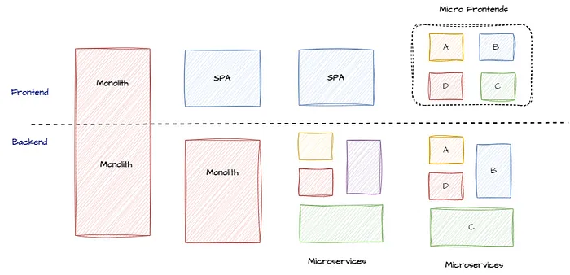
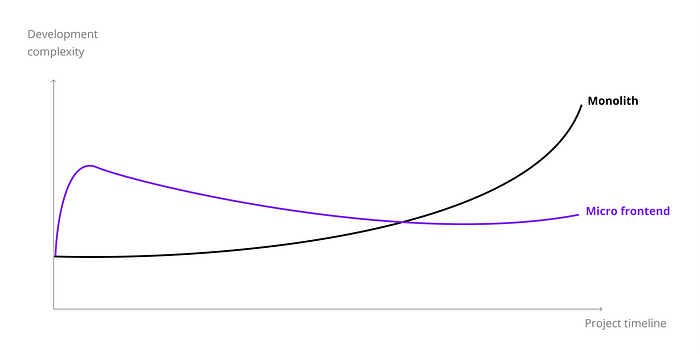

# Micro Frontend

## 1. 마이크로 프론트엔드

### 1.1. 마이크로 프론트엔드의 정의와 개념



프론트엔드 개발에 마이크로서비스 아키텍처의 개념을 적용한 것입니다. 대규모 애플리케이션을 여러 개의 작은 애플리케이션으로 나누어 개발, 배포, 유지보수하는 방법론으로 독립적으로 개발되고, 서로 다른 팀이 관리합니다.

- **독립성:** 각 마이크로 프론트엔드는 독립적인 모듈로, 다른 팀에 영향없이 기능을 개발, 테스트, 배포, 유지보수 가능
- **유연성:** 서로 다른 개발 프레임워크를 사용하여 구축 가능
- **확장성:** 각 마이크로 프론트엔드를 개별적으로 업그레이드

단점으로는 복잡성 증가, 통합 문제, 성능 문제 등이 있습니다.

<hr><!-- pagebreak -->

### 1.2. 모놀리식 프론트엔드와 마이크로 프론트엔드 비교



<hr><!-- pagebreak -->

| 측면             | 모놀리식 프론트엔드                                    | 마이크로 프론트엔드                               |
| ---------------- | ------------------------------------------------------ | ------------------------------------------------- |
| **코드베이스**   | 단일 코드베이스로 관리가 단순함                        | 여러 개의 독립적인 코드베이스로 관리 복잡성 증가  |
| **배포**         | 중앙 집중식 배포로 배포 과정이 단순함                  | 독립적인 배포로 각 애플리케이션의 배포 관리 필요  |
| **기술 스택**    | 동일한 기술 스택 사용으로 일관성 유지                  | 다양한 기술 스택 사용 가능, 통합 시 복잡성 증가   |
| **팀 관리**      | 팀 간 의존성 높아 협업 시 충돌 발생 가능               | 팀의 독립성 높아 각 팀이 독립적으로 작업 가능     |
| **확장성**       | 확장성 문제 발생 가능                                  | 각 마이크로 프론트엔드를 독립적으로 확장 가능     |
| **복잡성**       | 관리가 단순하지만, 애플리케이션이 커질수록 복잡성 증가 | 관리 복잡성 증가, 통합 및 조정 필요               |
| **성능**         | 초기 로드 시간 짧음                                    | 초기 로드 시간이 길어질 수 있음, 성능 최적화 필요 |
| **통합 문제**    | 통합 문제 발생 가능성 낮음                             | 여러 애플리케이션 통합 시 문제 발생 가능성 높음   |
| **중복 코드**    | 중복 코드 발생 가능성 낮음                             | 모듈 별로 중복 코드 발생 가능성 높음              |
| **UI/UX 일관성** | UI/UX 일관성 유지 용이                                 | UI/UX 파편화 가능성 높음, 디자인 시스템 필요      |

<hr><!-- pagebreak -->

### 1.4. 마이크로 프론트엔드 사례

#### 1.4.1. 마이크로 프론트엔드 도입 사례

- [넷플릭스](https://daunje0.tistory.com/m/299): Micro Frontend Architecture
- [강남언니](https://blog.gangnamunni.com/post/saas-microfrontends/): [SaaS] Micro Frontends를 위해 Module Federation 적용하기
- [LG CNS](https://www.lgcns.com/blog/cns-tech/cloud/50598/): 개발자의 업무 효율을 높여주는 새로운 아키텍처! 마이크로 프론트엔드 A to Z

#### 1.4.2. 고려해야 할 사항

- `expose` 변경마다 설정 파일(vite.config.ts)을 수정하는 대신, 자동화 방법을 도입하여 설정 파일을 자동으로 업데이트하도록 개선
- TypeScript를 사용할 때, 타입 정의 추가
- 런타임 환경에서 모듈이 조합되면서 예상치 못한 문제 발생과 통합의 복잡도 증가
  - Safe Component: 어느 한 요소에서의 에러가 전체 시스템에 영향을 주지 않도록 격리
    - Error Boundary: React의 Error Boundary를 사용하여 컴포넌트에서 발생하는 에러를 처리
    - UseErrorHandler Hook: 커스텀 훅을 사용하여 에러를 처리하고, 에러 발생 시 적절한 조치
- 모듈 별로 중복 코드가 많아지면서 전체적인 리소스의 크기 증가로 인한 프론트엔드 성능 저하 문제 발생
  - 공통 모듈을 별도 라이브러리로 분리하여 중복 코드를 줄이고, 코드 재사용성을 높임
  - Module Federation을 사용하여 런타임에 공통 모듈을 공유하고, 중복 코드를 줄임
- UI/UX 파편화 가능성으로 디자인 시스템 도입 필요
  - 공통 디자인 시스템을 도입하여 일관된 UI/UX를 유지하고, 각 마이크로 프론트엔드에서 재사용 가능하도록 함
  - Storybook을 사용하여 디자인 시스템을 문서화하고, 각 컴포넌트의 사용 예시를 제공

<hr><!-- pagebreak -->

## 2. 마이크로 프론트엔드 구현 방식

- Build-Time Integration (빌드 타임 통합)
- <u>**Run-Time Integration (런타임 통합)**</u>
- Server-Side Composition (서버 사이드 컴포지션)
- <u>**Web Components (웹 컴포넌트)**</u>

<hr><!-- pagebreak -->

## 3. Module Federation

Webpack 5에서 소개된 모듈 페더레이션(Module Federation)은 종속성 공유, 중복성 감소, 상호운용성 개선 등 마이크로 프론트엔드 아키텍처의 주요 과제를 해결하는 기능입니다. 이를 통해 각 마이크로 프론트엔드가 독립적으로 개발되고 배포될 수 있으며, 런타임에 필요한 모듈을 동적으로 로드하여 통합할 수 있습니다.

### 3.1. 특징

- **종속성 공유:**
  - 여러 애플리케이션 간에 공통 모듈을 공유하여 종속성을 관리할 수 있습니다.
  - 중복된 종속성을 줄이고, 애플리케이션의 크기를 최적화할 수 있습니다.
- **중복성 감소:**
  - 공통 모듈을 공유함으로써 중복된 코드의 양을 줄일 수 있습니다.
  - 코드 재사용성을 높이고, 유지보수성을 향상시킬 수 있습니다.
- **상호운용성 개선:**
  - 서로 다른 기술 스택을 사용하는 애플리케이션 간의 상호운용성을 개선할 수 있습니다.
  - 각 애플리케이션이 독립적으로 개발되고 배포될 수 있습니다.
- **동적 로딩:**
  - 필요한 모듈만 런타임에 동적으로 로드하여 애플리케이션의 초기 로딩 시간을 줄일 수 있습니다.
  - 성능 최적화에 도움이 됩니다.

### 3.2. 역할

- **코드 재사용:**
  - 여러 애플리케이션 간에 공통 모듈을 공유하여 중복된 코드를 줄이고, 유지보수성을 향상시킬 수 있습니다.
- **독립적 배포:**
  - 각 애플리케이션이 독립적으로 배포될 수 있어 배포 주기를 단축하고, 변경 사항을 빠르게 반영할 수 있습니다.
- **유연한 아키텍처:**
  - 각 팀 또는 애플리케이션에 서로 다른 기술 스택을 사용할 수 있습니다.
- **성능 최적화:**
  - 필요한 모듈만 동적으로 로드하여 애플리케이션의 초기 로딩 시간을 줄일 수 있습니다.

<hr><!-- pagebreak -->

### 3.3. Module Federation 구현

- ~~Webpack ModuleFederationPlugin~~
- **@module-federation/vite**
  - `remoteEntry.js`
  - `mf-manifest.json` :
- _@originjs/vite-plugin-federation_
  - `remoteEntry.js`

<hr><!-- pagebreak -->

### 3.4. 코드 설명

- **@module-federation/vite**
  Remote Module과 Host App에 의존성을 설치하고 `vite.config.ts`를 수정합니다.

```sh
pnpm add @module-federation/vite
```

**MODULE**

```ts
  plugins: [
    federation({
      name: "ModulePure", // *** 모듈 이름
      filename: "remoteEntry.js",
      manifest: true, // *** 매니페스트 파일을 생성합니다. mf-manifest.json
      exposes: {
        "./app": "./src/App",
      },
      shared: {
        react: { singleton: true },
        "react/": { singleton: true },
        "react-dom": { singleton: true },
        "react-dom/": { singleton: true },
      },
    }),
  ],
  // 빌드 설정
  build: { target: "chrome89" },
  // 개발 서버 설정
  server: { port: 3001, strictPort: true },
  // 빌드 후 미리보기
  preview: { port: 3001, strictPort: true },
```

<!-- pagebreak -->

**HOST**

```ts
  plugins: [
    federation({
      name: "hostApp", // 호스트 앱이름
      remotes: {
        // remoteEntry.js 파일을 직접 설정합니다.
        // *** 모듈에서 설정한 "name"과 동일한 값을 설정합니다.
        // ModulePure: { type: "module", name: "ModulePure", entry: "http://localhost:3001/remoteEntry.js" },

        // 매니페스트 파일을 설정
        ModulePure: { type: "module", name: "ModulePure", entry: "http://localhost:3001/mf-manifest.json" },
        ModuleShadowDOM: { type: "module", name: "ModuleShadowDOM", entry: "http://localhost:3002/mf-manifest.json" },
        ModuleWebComponents: { type: "module", name: "ModuleWebComponents", entry: "http://localhost:3003/mf-manifest.json" },
      },
      shared: {
        react: {
          name: "react",
          version: '18.3.1',
          shareScope: 'default',
          singleton: true,
          requiredVersion: '18.3.1',
          strictVersion: true,
        },
        "react/": { singleton: true },
        "react-dom": { singleton: true },
        "react-dom/": { singleton: true },
      },
    }),
  ],
  // 빌드 옵션
  build: { target: "chrome89" },
  // 개발 서버
  server: { port: 3000, strictPort: true, open: true},
  // 빌드 한 파일 미리보기
  preview: { port: 3000, strictPort: true, open: true },
```

**모듈 사용**

```ts
const ModulePure = React.lazy(() => import('ModulePure/app'))

export function App() => {
  return (
    <div>
      <ModulePure />
    </div>
  );
}
```

<hr><!-- pagebreak -->

- **@originjs/vite-plugin-federation**

<hr><!-- pagebreak -->

## 4. Web Components

Web Components는 HTML, CSS, JavaScript를 캡슐화하여 재사용 가능한 커스텀 엘리먼트를 만들 수 있는 웹 표준 기술입니다. 이를 통해 개발자는 독립적이고 재사용 가능한 UI컴포넌트를 만들 수 있으며, 다양한 프레임워크와 라이브러리에서 사용할 수 있습니다.

<hr><!-- pagebreak -->

### 4.1. 개념

- **Custom Elements:** 새로운 HTML 태그를 정의할 수 있습니다.
- **Shadow DOM:** 컴포넌트의 내부 DOM 구조와 스타일을 캡슐화하여 외부와 격리합니다.
- **HTML Templates:** 재사용 가능한 HTML 템플릿을 정의할 수 있습니다.
- **ES Modules:** 모듈화된 JavaScript 코드를 사용할 수 있습니다.

### 4.2. 특징

- **재사용성:** Web Components는 재사용 가능한 커스텀 엘리먼트를 제공하여 코드 재사용성을 높입니다.
- **캡슐화:** Shadow DOM을 사용하여 스타일과 DOM 트리를 캡슐화하여 외부와 격리합니다. 이를 통해 스타일 충돌을 방지할 수 있습니다.
- **호환성:** Web Components는 표준 웹 기술을 기반으로 하므로, 다양한 프레임워크와 라이브러리에서 사용할 수 있습니다.
- **모듈화:** ES Moudles를 사용하여 모듈화된 JavaScript 코드를 작성할 수 있습니다. 이를 통해 코드의 유지보수성과 가독성을 높일 수 있습니다.

<hr><!-- pagebreak -->

### 4.3. Web Components를 사용한 마이크로 프론트엔드 구현

### 4.4. 코드 설명

<hr><!-- pagebreak -->

## 5. 성능 최적화

### 5.1. 성능 이슈

### 5.2. 성능 최적화를 위한 전략과 기법

### 5.3. 실습 예제와 코드 설명

<hr><!-- pagebreak -->

## 6. 마이크로 프론트엔드와 DevOps

- 마이크로 프론트엔드의 배포 전략
- CI/CD 파이프라인 구축
- 모니터링과 로깅
